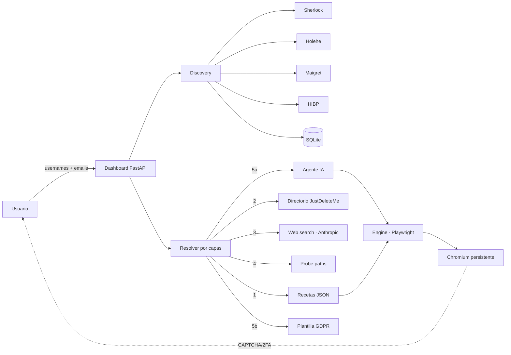

<div align="center">

# 🧹 Rastrillo

**Borra tus cuentas online de una sentada. Local, privado, human-in-the-loop.**

[](https://github.com/je7remy/Rastrillo/actions/workflows/ci.yml)
[](LICENSE)
[](https://www.python.org/downloads/)
[](pyproject.toml)
[](#-instalación)

</div>

---

> Quince años acumulando cuentas. Una tarde para limpiarlas. Tú das los
> usernames y correos; Rastrillo descubre dónde tienes cuenta, decide cómo
> borrar cada una y conduce el flujo en un Chromium. Lo que requiere humano
> (CAPTCHA, 2FA, "confirma con tu contraseña") te lo pasa. **Solo cuentas
> tuyas — borrar tus datos es tu derecho; husmear en los de otros no.**

## 📑 Tabla de contenidos

- [Características](#-características)
- [Arquitectura en 30 segundos](#-arquitectura-en-30-segundos)
- [Requisitos](#-requisitos)
- [Instalación](#-instalación)
  - [Linux / macOS](#linux--macos)
  - [Windows](#windows)
  - [Instalación manual](#instalación-manual)
  - [pipx (comando global, opcional)](#pipx-comando-global-opcional)
  - [Arch Linux (AUR)](#arch-linux-aur)
- [Uso](#-uso)
  - [Dashboard (modo por defecto)](#dashboard-modo-por-defecto)
  - [CLI auxiliar](#cli-auxiliar)
  - [Modo simulación](#modo-simulación)
- [Cómo decide qué hacer con cada cuenta](#-cómo-decide-qué-hacer-con-cada-cuenta)
- [Estructura del proyecto](#-estructura-del-proyecto)
- [Variables de entorno](#-variables-de-entorno)
- [Lo que NO hace](#-lo-que-no-hace)
- [Dónde vive todo](#-dónde-vive-todo)
- [Tests](#-tests)
- [Troubleshooting](#-troubleshooting)
- [Contribuir](#-contribuir)
- [Seguridad](#-seguridad)
- [Transparencia y modelo de amenazas](#-transparencia-y-modelo-de-amenazas)
- [Créditos](#-créditos)
- [Licencia](#-licencia)

---

## ✨ Características

- 🔍 **Descubrimiento multi-fuente** — Sherlock + Holehe siempre; Maigret y HaveIBeenPwned opcionales.
- 🧩 **Resolver por capas** — recetas JSON → directorio JustDeleteMe → web search IA → sondeo de paths → agente IA → borrador GDPR.
- 🖥️ **Dashboard local** — FastAPI + estática en `http://127.0.0.1:8765` con token de auth.
- 🌍 **Plantillas GDPR en 6 idiomas** — EN, ES, RU, PT-BR, FR, DE, con detección por TLD.
- 🧑‍✈️ **Human-in-the-loop** — CAPTCHA, 2FA y confirmaciones se pasan al usuario.
- 🧠 **Aprende sobre la marcha** — la secuencia que cierra un borrado se serializa como receta para el próximo run.
- 🔐 **Cero contraseñas guardadas** — solo perfil de Chromium persistente.
- ⏳ **Eliminación programada** — registra el plazo que da la plataforma ("en 30 días"), con cuenta regresiva, fecha final y barra de progreso. Al vencer no marca nada solo: ofrece **Verificar**.
- 💾 **Resumible** — `current_step` y hash de receta persistidos, audit log append-only, backup de DB antes de borrados masivos.
- 🧪 **Modo simulación** — flujo completo sin disparar la acción destructiva final.
- 📤 **Informe exportable** — JSON, CSV o PDF.
- 🌐 **Inteligencia de dominio** — WHOIS + DNS (A/MX/NS/TXT) + correlación heurística de proveedores, para tu propia infraestructura o la que tienes permiso de auditar.

---

## 🏗️ Arquitectura en 30 segundos



El resolver prueba las capas en orden y se queda con la primera accionable.
Cada cuenta termina con una `Resolution` de tipo `auto` (motor lo hace
solo), `semi_auto` (un clic del usuario) o `email_draft` (borrador GDPR
listo).

---

## 📋 Requisitos

- **Python 3.10+**
- **~250 MB libres** (Chromium para Playwright pesa unos 180 MB)
- **Conexión a internet** — para descubrir cuentas y borrar
- *(Opcional)* **Clave de Anthropic** — activa el agente IA y la búsqueda web
- *(Opcional)* **Clave de HaveIBeenPwned** — activa el cruce con brechas

> ℹ️ La **Inteligencia de dominio** no necesita binarios externos: WHOIS va por
> socket TCP/43 (stdlib) y DNS por `dnspython` (dependencia instalada por el
> instalador). No requiere `whois` ni `dig` en el PATH.

---

## 📦 Instalación

### Linux / macOS

```bash
git clone https://github.com/je7remy/Rastrillo.git
cd rastrillo
bash install.sh
```

### Windows

Desde PowerShell, en la carpeta del repo:

```powershell
.\install.ps1
```

Si PowerShell bloquea el script por política de ejecución:

```powershell
powershell -ExecutionPolicy Bypass -File .\install.ps1
```

El instalador crea un venv en `.venv\`, instala dependencias, descarga
Chromium y registra el ejecutable dentro del venv. **Es idempotente**:
lánzalo dos veces sin miedo.

> ℹ️ **El ejecutable queda en `.venv\Scripts\rastrillo.exe`**, dentro del
> venv del repo. Esa carpeta **no está en tu PATH global**, así que el
> comando `rastrillo` "a secas" sin contexto no funciona. Usa los wrappers
> (`.\rastrillo.ps1` / `rastrillo.cmd`) que ya vienen en el repo, **o**
> instala globalmente con [pipx](#pipx-comando-global-opcional). Detalles
> en [Troubleshooting](#-troubleshooting).

### Instalación manual

```bash
python -m venv .venv
source .venv/bin/activate          # Linux/Mac
# .\.venv\Scripts\Activate.ps1     # Windows PowerShell
pip install -r requirements.txt
pip install -e .
playwright install chromium
```

Para reproducibilidad bit-a-bit (CI, releases, `pip-audit`):

```bash
pip install -r requirements.lock
```

Regenerar el lock cuando cambien las dependencias:

```bash
pip install pip-tools
python -m piptools compile pyproject.toml -o requirements.lock
```

`pip-tools` es solo build-time; **no** debe acabar en `pyproject.toml`.

### pipx (comando global, opcional)

Si quieres que `rastrillo` funcione como cualquier comando del sistema,
desde cualquier carpeta y sin activar venvs:

```bash
pipx install .
```

Y a continuación, **comando importante**: pipx solo expone en PATH los
scripts del paquete principal (`rastrillo`, `rs`). El script `playwright`
queda dentro del venv aislado de pipx, no en PATH. Para descargar Chromium
tienes que invocarlo por la ruta del venv de pipx:

**Linux / macOS:**

```bash
venv="$(pipx environment --value PIPX_LOCAL_VENVS)/rastrillo"
"$venv/bin/python" -m playwright install chromium
```

**Windows (PowerShell):**

```powershell
$venv = "$(pipx environment --value PIPX_LOCAL_VENVS)\rastrillo"
& "$venv\Scripts\python.exe" -m playwright install chromium
```

A partir de aquí, `rastrillo` funciona desde cualquier carpeta.

### Arch Linux (AUR)

```bash
cd packaging/aur
makepkg -si
playwright install chromium
```

> ⚠️ El `PKGBUILD` usa `sha256sums=('SKIP')` mientras no exista release
> taggeada `v0.1.0` en GitHub. Cuando se cree, hay que regenerar el
> checksum y `.SRCINFO`. Ver `packaging/aur/PKGBUILD` para detalles.

Si `sherlock` u `holehe` no están como paquete Arch:

```bash
pipx install sherlock-project
pipx install holehe
```

Rastrillo los detecta automáticamente en `PATH`.

---

## 🚀 Uso

### Dashboard (modo por defecto)

**Linux / macOS:**

```bash
./rastrillo.sh
```

**Windows (PowerShell):**

```powershell
.\rastrillo.ps1
```

**Windows (Explorador):** doble-click en `rastrillo.cmd`.

**Si instalaste con pipx**, desde cualquier carpeta:

```bash
rastrillo
```

Cualquiera de los anteriores arranca el servidor local en
`http://127.0.0.1:8765` y abre el navegador con el token de auth en la
URL.

Verás **dos ventanas**:

1. **Panel web** — decides qué hacer con cada cuenta.
2. **Chromium persistente** — ejecuta los borrados; aquí resuelves CAPTCHA y 2FA.

Flujo típico:

1. Metes username y/o correo → **Escanear**.
2. Triage: confirmas cuáles son tuyas. Sherlock genera falsos positivos con
   usernames cortos — esto no es decorativo. Cada fila lleva su nivel de
   confianza (`high`/`medium`/`low`) y, debajo, **chips con el motivo** de
   esa confianza: por qué subió o bajó. Por ejemplo *"username corto"*,
   *"coincide en la ruta"*, *"coincide en subdominio"*, *"email + username"*
   (dos fuentes independientes vieron el mismo sitio), *"2 buscadores"*,
   *"brecha de datos"*, *"el sitio responde a cualquiera"*. Pasa el ratón por
   encima para la explicación completa. Los chips solo aparecen mientras la
   cuenta no esté confirmada como tuya, que es cuando sirven. Con eso puedes
   usar **Descartar low** en lote sin miedo.

   El enlace **perfil** de cada fila es la URL del hallazgo, la misma sobre la
   que se calcularon esos chips. Si el resolver además encontró la página de
   baja, va aparte como **cómo darse de baja**.
3. Para cada cuenta confirmada: **Eliminar**, **Anonimizar** o **Conservar**.
   Las profesionales (`tiktok`, `instagram`, `linkedin`, `github`) salen como
   conservadas por defecto.
4. Si la plataforma pide CAPTCHA/2FA, la fila pasa a **Esperándote**. Lo
   resuelves en el Chromium y pulsas **Continuar** en el panel.

### CLI auxiliar

Tareas sin abrir UI (debug, scripts, automatización):

```bash
./rastrillo.sh scan --user je7remy --email tu@correo.com   # discovery headless
./rastrillo.sh list [--status STATUS]                      # lista la DB
./rastrillo.sh report --format json|csv|pdf --out FILE     # exporta informe
./rastrillo.sh canario https://sitio.com/u/je7remy         # ¿el sitio verifica usuarios?
```

`canario` es el helper de debug del canario a nivel de sitio: pregunta al sitio
por dos usernames inventados y te enseña la evidencia cruda (status de cada
uno, marcadores de "no existe", similitud entre los cuerpos, veredicto y por
qué). **No toca la DB ni la caché de veredictos.** Acepta también un host pelado
(`./rastrillo.sh canario baby.ru`) y `--user` para decirle qué identificador
sustituir. Ejemplo real:

```
→ https://cavalier.hudsonrock.com/api/...?username=nwglmttgy    status=200
→ https://cavalier.hudsonrock.com/api/...?username=onchim6bp7z1 status=200
  similitud entre los dos cuerpos: 100.0% (umbral 95%)
  VEREDICTO: indiscriminado
```

(En Windows sustituye `./rastrillo.sh` por `.\rastrillo.ps1`.)

> 🔒 **Invariante**: el modo CLI **no** ejecuta acciones destructivas
> headless. `scan` solo descubre, `report` solo exporta, `list` solo lee.
> El borrado y la anonimización siguen exigiendo dashboard web + Chromium
> con pausas para humano. Eso no cambia.

### Modo simulación

Toggle en la barra superior del dashboard, o al arrancar:

```bash
RASTRILLO_DRY_RUN=1 ./rastrillo.sh
```

```powershell
$env:RASTRILLO_DRY_RUN = "1"; .\rastrillo.ps1
```

Ejecuta el flujo completo sin disparar la acción destructiva final.

### Inteligencia de dominio

En el dashboard, la sección **Inteligencia de dominio** toma un dominio y
reúne información pública: WHOIS (registrador, fechas de creación/expiración,
nameservers, estados), DNS (A/MX/NS/TXT) y una correlación heurística de
proveedores y servicios (p. ej. MX → proveedor de correo, NS → DNS/hosting,
SPF/verificaciones TXT → SaaS). Cada inferencia se muestra con su nivel de
confianza: son **candidatos, no hechos confirmados**.

> 🔒 **Alcance**: esto es recon OSINT **defensivo**. WHOIS y DNS son datos
> públicos, y la función es para **tu propia infraestructura o la que tienes
> permiso de auditar** (el "rastrillo corporativo"), no para perfilar a
> terceros. No necesita `whois`/`dig` en el PATH: WHOIS va por TCP/43 (stdlib)
> y DNS por `dnspython`.

Cada análisis se guarda (un informe por dominio) y el histórico se muestra
debajo como una lista de tarjetas **colapsables**: la más reciente abierta y
el resto plegadas, con dominio, fecha y un resumen de una línea (nº de
registros DNS · nº de correlaciones · registrador) visible sin desplegar.
Hay **"Colapsar todo"** / **"Expandir todo"**, y el estado plegado se recuerda
por dominio entre recargas. Puedes **eliminar** un informe suelto o **limpiar
todo el histórico** (con confirmación; antes de una limpieza total se guarda
una copia de la base de datos en `~/.rastrillo/backups/`). Consultar el
histórico no vuelve a la red: solo lee lo ya guardado.

---

## 🎯 Cómo decide qué hacer con cada cuenta

| # | Capa | Cómo | Devuelve |
|---|---|---|---|
| 1 | **Receta JSON** | `rastrillo/recipes/*.json` u `~/.rastrillo/recipes/` | `auto` |
| 2 | **JustDeleteMe** | Lookup por host en el directorio cacheado | `auto` / `semi_auto` |
| 3 | **Web search** | Anthropic web_search en idioma del TLD | `auto` / `semi_auto` |
| 4 | **Probe paths** | GET a `/settings`, `/cuenta`, `/удалить`… | `semi_auto` |
| 5a | **Agente IA** | Bucle ver/decidir/pulsar sobre Chromium | `deleted` / `anonymized` / `manual` |
| 5b | **GDPR mail** | Borrador Art. 17 en el idioma del sitio | `email_draft` (siempre) |

Sin `ANTHROPIC_API_KEY` se saltan las capas 3 (web search) y 5a (agente
IA). El resolver sigue produciendo `semi_auto` por probe o `email_draft`
con la plantilla GDPR estática en uno de los 6 idiomas soportados.

Si pasados 30 días desde que enviaste un correo GDPR no hay respuesta, hay
un botón **Seguimiento** que genera el follow-up citando el artículo 12.3
del RGPD.

---

## 📁 Estructura del proyecto

```text
rastrillo/
├── cli.py                  # Entrypoint del CLI
├── pyproject.toml          # Packaging + entry points
├── install.sh / install.ps1
├── rastrillo.sh / .ps1 / .cmd   # Wrappers sin activar venv
├── requirements.txt        # Rangos flexibles
├── requirements.lock       # Versiones fijadas (CI, releases)
│
├── rastrillo/
│   ├── config.py           # Rutas, tokens, flags
│   ├── db.py               # SQLite + migraciones
│   ├── discovery.py        # Wrappers Sherlock/Holehe/Maigret/HIBP
│   ├── canario.py          # Canario a nivel de sitio (2 falsos, veredicto cacheado)
│   ├── directory.py        # Cliente JustDeleteMe
│   ├── resolver.py         # Resolver por capas
│   ├── recipes.py          # Loader de recetas JSON
│   ├── recipes_auto.py     # Recetas auto-aprendidas
│   ├── engine.py           # Motor Playwright
│   ├── ai_assist.py        # Capa IA opcional (Anthropic)
│   ├── hibp.py             # Cliente HaveIBeenPwned
│   ├── domain_intel.py     # Domain Intelligence (WHOIS + DNS + correlación)
│   ├── hostutil.py         # Normalización de host / slug
│   ├── jobs.py             # Coordinación server↔engine
│   ├── server.py           # API FastAPI
│   ├── audit.py            # Log append-only
│   ├── report_pdf.py       # Generación del informe PDF
│   ├── reports.py          # Construcción de informes (json/csv/pdf)
│   ├── recipes/            # Recetas de ejemplo
│   └── static/             # Frontend (index.html + css + js)
│
├── tests/                  # 292 tests con unittest stdlib
│   ├── test_confidence_signals.py  # Confianza y falsos positivos (offline)
│   ├── test_canario.py         # Canario a nivel de sitio (offline, red mockeada)
│   ├── test_url_del_hit.py     # Frontera `@ ~ #` + la URL del hit en el triage
│   ├── test_domain_intel.py    # Domain Intelligence (offline, red mockeada)
│   └── test_resolve_tool.py    # Capa de web search del resolver
├── packaging/aur/PKGBUILD  # Empaquetado Arch
└── .github/workflows/ci.yml
```

---

## ⚙️ Variables de entorno

Las 19 reales del código:

| Variable | Default | Para qué |
|---|---|---|
| `RASTRILLO_HOME` | `~/.rastrillo` | Raíz de todo (`%USERPROFILE%\.rastrillo` en Windows) |
| `RASTRILLO_TOKEN` | aleatorio por arranque | Auth del servidor local |
| `RASTRILLO_ALLOWED_HOSTS` | `127.0.0.1:8765,localhost:8765,testserver` | Hosts permitidos en el header `Host` (anti DNS rebinding) |
| `RASTRILLO_ALLOW_QUERY_TOKEN` | off | **Solo tests.** Acepta `?token=` en la query |
| `RASTRILLO_DRY_RUN` | off | Modo simulación al arrancar |
| `ANTHROPIC_API_KEY` | — | Activa agente IA + web search |
| `RASTRILLO_AI_MODEL` | `claude-sonnet-4-6` | Modelo de Anthropic |
| `RASTRILLO_AI_TOKEN_BUDGET` | `8000` | Presupuesto de tokens por bucle del agente IA |
| `RASTRILLO_AI_SCREENSHOTS` | `0` (off) | `>0` activa screenshot opcional por turno del agente |
| `RASTRILLO_HIBP_API_KEY` | — | Activa discovery por HaveIBeenPwned |
| `RASTRILLO_RESOLVER_WORKERS` | `5` (rango efectivo [1, 16]) | Pool del auto-resolver |
| `RASTRILLO_PROBE_DELAY` | `1.5` | Segundos entre GETs al mismo host |
| `RASTRILLO_DIR_MAX_AGE_DAYS` | `30` | Edad max del directorio antes de refresh auto |
| `RASTRILLO_CANARIO_MAX_AGE_DAYS` | `30` | Edad max de un veredicto del canario antes de re-probar el sitio |
| `RASTRILLO_SHERLOCK_TIMEOUT` | `900` | Timeout global de Sherlock (mín 10 s) |
| `RASTRILLO_SHERLOCK_SITE_TIMEOUT` | `60` | Timeout per-site de Sherlock (mín 10 s) |
| `RASTRILLO_HOLEHE_TIMEOUT` | `600` | Timeout global de Holehe (mín 10 s) |
| `RASTRILLO_MAIGRET_TIMEOUT` | `300` | Timeout global de Maigret (mín 10 s) |
| `RASTRILLO_AUDIT_MAX_BYTES` | `5242880` (5 MiB) | Tamaño que dispara rotación del audit |

---

## 🚫 Lo que NO hace

Por diseño:

- ❌ No resuelve CAPTCHA ni evade detección de bots.
- ❌ No guarda contraseñas.
- ❌ No procesa varias cuentas en paralelo (un Chromium, una a una).
- ❌ No verifica automáticamente que las cuentas detectadas sean tuyas
  — te obliga a confirmar antes de cualquier acción destructiva.

En la práctica:

- Las recetas JSON se rompen cuando los sitios cambian su HTML. Copia la
  receta del paquete a `~/.rastrillo/recipes/` y ajusta el selector que
  falló.
- HIBP detecta exposición en brechas, no cuentas activas. Esos hits van a
  una pestaña aparte ("Brechas") y solo entran al flujo cuando confirmas
  "sí, tengo cuenta aquí".
- Algunos sitios solo borran por correo a soporte. Esos quedan en
  `email_draft`, los envías tú y los marcas como enviados.
- El agente IA puede equivocarse: antes de sellar `deleted` re-visita la
  URL del perfil; si responde 404 o el body contiene "cuenta cerrada" lo
  da por bueno; si sigue cargando, lo deja en `manual`. Redirecciones a
  login no cuentan como éxito.

---

## 💾 Dónde vive todo

Todo bajo `~/.rastrillo/` (`%USERPROFILE%\.rastrillo\` en Windows):

| Ruta | Contenido |
|---|---|
| `rastrillo.db` | SQLite con cuentas y eventos |
| `directory.json` | Copia local de JustDeleteMe |
| `discovered.json` | Caché del resolver por host |
| `browser-profile/` | Perfil de Chromium con tus sesiones |
| `backups/` | Snapshots automáticos antes de borrados masivos |
| `audit.json` | Log append-only de acciones destructivas |
| `recipes/` | Tus recetas personales (pisan a las del paquete) |
| `screenshots/` | Capturas del motor en pasos clave y errores |

Lo único que sale del disco: descarga del directorio, GETs a sitios donde
vas a borrar, Anthropic si IA está activada, HIBP si hay clave. El modelo
IA recibe estructura de página (árbol de accesibilidad + texto visible),
**nunca** cookies ni contraseñas.

---

## 🧪 Tests

```powershell
.\.venv\Scripts\python.exe -m unittest discover -t . -s tests -v
```

```bash
.venv/bin/python -m unittest discover -t . -s tests -v
```

Suite con `unittest` de stdlib, sin dependencias nuevas. **247 tests**
(~1 minuto en Windows, ~30 s en Linux). Cada test corre con su propio
`RASTRILLO_HOME` en tempdir.

Para validar el motor sin entrar a webs reales, mira
`tests/test_engine_html_local.py` (servidor HTTP local + FakePage).

---

## 🆘 Troubleshooting

### `'rastrillo' no se reconoce como comando`

El ejecutable vive en `.venv\Scripts\rastrillo.exe` (Windows) o
`.venv/bin/rastrillo` (Linux/Mac) y esa carpeta **no está en tu PATH
global**. Tres soluciones, de menos a más invasiva:

**1. Usa los wrappers (recomendado para uso local):**

```powershell
# Windows
.\rastrillo.ps1
rastrillo.cmd          # o doble-click desde el Explorador
```

```bash
# Linux/Mac
./rastrillo.sh
```

**2. Activa el venv antes de la sesión:**

```powershell
# Windows
.\.venv\Scripts\Activate.ps1
rastrillo
```

```bash
# Linux/Mac
source .venv/bin/activate
rastrillo
```

**3. Instala globalmente con pipx:**

```bash
pipx install .
```

Ver la sección [pipx](#pipx-comando-global-opcional) para el comando
adicional que descarga Chromium dentro del venv de pipx.

### Chromium no se descarga

```powershell
.\.venv\Scripts\python.exe -m playwright install chromium
```

```bash
.venv/bin/python -m playwright install chromium
```

En Linux puede faltar `libnss3` u otras libs del sistema:

```bash
sudo .venv/bin/python -m playwright install-deps chromium
```

### PowerShell bloquea `install.ps1`

```powershell
powershell -ExecutionPolicy Bypass -File .\install.ps1
```

### Sherlock / Holehe no aparecen en el scan

Verifica que están en `PATH`:

```bash
sherlock --version
holehe --version
```

Si faltan:

```bash
pipx install sherlock-project
pipx install holehe
```

### El agente IA no se activa

Necesitas `ANTHROPIC_API_KEY` en el entorno:

```bash
export ANTHROPIC_API_KEY=sk-ant-...        # Linux/Mac
```

```powershell
$env:ANTHROPIC_API_KEY = "sk-ant-..."      # Windows PowerShell
```

Sin clave, el resolver sigue funcionando con directorio + probe + GDPR.

---

## 🤝 Contribuir

1. Fork + branch.
2. Antes de cualquier cambio: corre la suite (`unittest discover`).
3. Código y comentarios en **español**.
4. No introduzcas dependencias nuevas sin justificación.
5. Lo específico de cada plataforma vive en **recetas o directorio**,
   nunca hardcodeado en `engine.py`.
6. Antes de cerrar un cambio: `python -m py_compile` sobre lo tocado +
   suite completa.

Ver [`CLAUDE.md`](CLAUDE.md) para el manual interno detallado.

---

## 🔐 Seguridad

Si encuentras una vulnerabilidad, **no abras un issue público**. Mándame
un correo a [je7remy@gmail.com](mailto:je7remy@gmail.com) y respondo en
máximo 72 horas.

Invariantes que facilitan el threat model:

- Cero contraseñas guardadas en disco.
- Token de auth obligatorio en TODOS los POST y todos los `/api/*`.
- Allowlist de hosts contra DNS rebinding.
- SSRF guard en el resolver (solo HTTPS, IPs públicas).
- Backup + audit antes de cualquier acción destructiva.

Para el inventario completo de tráfico saliente (qué se envía, cuándo y
con qué archivo:línea verificarlo) y el modelo de amenazas, ver
[**TRANSPARENCIA.md**](TRANSPARENCIA.md).

---

## 🔎 Transparencia y modelo de amenazas

Cada conexión que Rastrillo abre, cada dato que sale del proceso, y cómo
comprobarlo tú mismo leyendo el código: [**TRANSPARENCIA.md**](TRANSPARENCIA.md).

---

## 🙏 Créditos

Rastrillo se apoya en:

- [Sherlock](https://github.com/sherlock-project/sherlock) — username discovery
- [Holehe](https://github.com/megadose/holehe) — email discovery
- [Maigret](https://github.com/soxoj/maigret) — extended username discovery
- [JustDeleteMe](https://justdelete.me/) — directorio público de URLs de borrado
- [HaveIBeenPwned](https://haveibeenpwned.com/) — cruce con brechas
- [Playwright](https://playwright.dev/) — automatización del navegador
- [FastAPI](https://fastapi.tiangolo.com/) — dashboard local
- [Anthropic](https://anthropic.com/) — agente IA opcional

---

## 📄 Licencia

MIT. Ver [LICENSE](LICENSE). Copyright © 2026 Jeremy <je7remy@gmail.com>.
